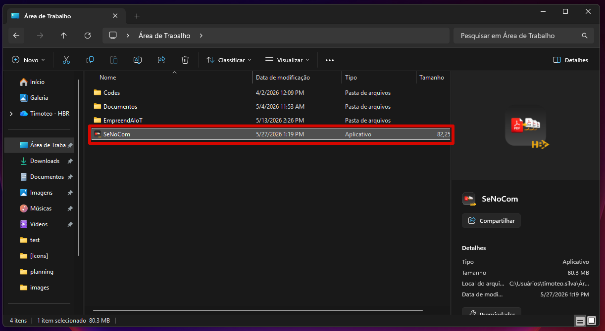
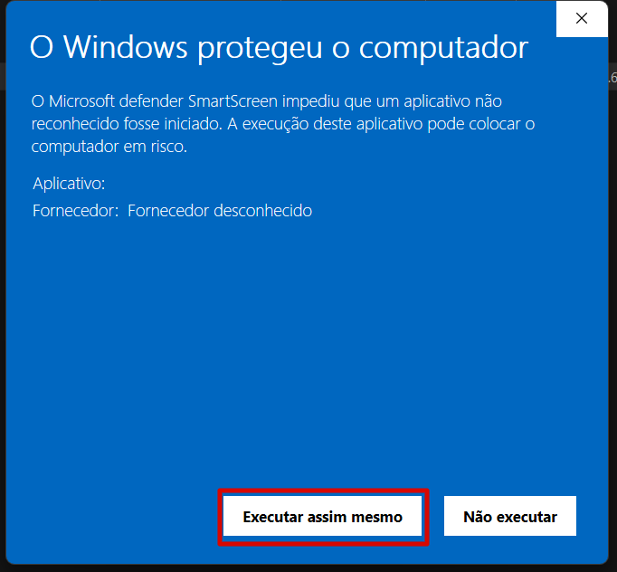
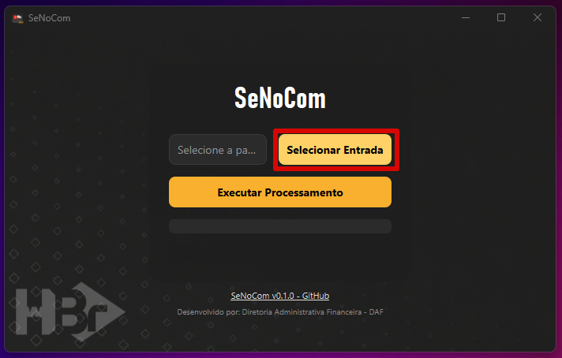
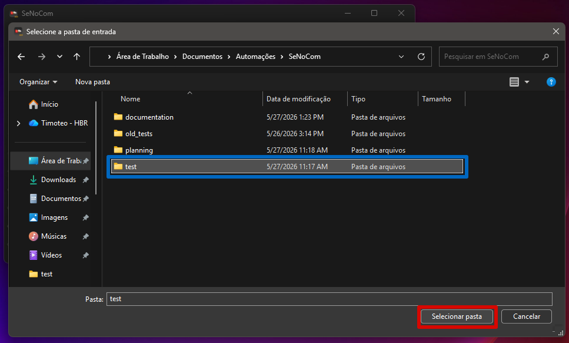

# SeNoCom

Repositório oficial do programa SeNoCom (*Se*para e *No*meia *Com*provantes), para separar e nomear comprovantes automaticamente.

## 1. Requisitos

Para uso adequado do programa, o usuário deve possuir:
- **Sistema Operacional:** Windows 10 ou 11

## 2. Guia de Uso

### 2.1 Baixando e Instalando o Programa

Para usar o `SeNoCom`, primeiro, você deve baixar o arquivo `.exe` disponível [aqui](https://github.com/imbaTIMvel/senocom/releases). Procure pela versão mais recente (*Latest*) e clique no arquivo `.exe` para fazer o download.

> [!Warning]
> Caso você ainda tenha o executável de uma versão antiga do programa, recomenda-se excluí-lo.

Baixado o programa, você pode colocar o arquivo `.exe` onde achar melhor.

### 2.2 Abrindo o Programa

Feito isso, clique no arquivo `.exe` para abrir o programa.

> [!Warning]
> É possível que o *Windows Defender* acuse o programa como "software perigoso". Neste caso, para executá-lo, você deve clicar em `Mais Informações` e, depois, no botão `Executar assim mesmo`.

Antes de iniciar uma operação, junte os compilados de comprovantes em uma única pasta.

### 2.3 Interface do Programa

#### 2.3.1 Pasta de Entrada

O programa possui um único campo para a seleção da pasta com os compilados de comprovantes (que se quer separar). Para selecionar a pasta de entrada, deve-se clicar no botão `Selecionar Entrada`. Feito isso, o programa abre um diálogo do *Explorador de Arquivos*, permitindo que o usuário encontre e selecione a pasta desejada.

Após selecionar a pasta, o campo de seleção é atualizado.

#### 2.3.2 Botão de Execução

Selecionada a pasta, ao clicar no botão `Executar Processamento`, o programa permite que o usuário selecione uma pasta de saída dentro de sua máquina - que é o local onde os comprovantes individuais serão armazenados, ao final da operação. Feito isso, o programa processa os arquivos compilados e os separa, nomeando cada comprovante identificado com as informações apropriadas.

### 2.4 Modos de Operação

Por conveniência, o programa possui 2 modos de operação diferentes, que funcionam a depender dos arquivos presentes na pasta de entrada.

#### 2.4.1 Sem Correspondência

| Arquivos na pasta de entrada       | Padronização | Extensão do arquivo |
| ---------------------------------- | ------------ | ------------------- |
| Documentos com vários comprovantes | Itaú e BRB   | `.pdf`              |

Neste modo, o programa apenas identifica a quantidade de comprovantes dentro dos PDFs inseridos na pasta de entrada, separando-os individualmente e os renomeando a partir das informações extraídas de cada documento (data da transação, nome do beneficiário e valor), seguindo a padronização:

`DD-MM Nome R$ Valor.pdf`

Sendo:
- `DD-MM`: O dia e mês da transação, em formato numérico. Em caso de não identificação do dado, constará como "SEM-DATA";
- `Nome`: O nome do beneficiário. Em caso de não identificação do dado, constará como "SEM-NOME";
- `Valor`: O valor da transação, em R$. Em caso de não identificação do dado, constará como "SEM-VALOR".

#### 2.4.2 Correspondência Ativa

| Arquivos na pasta de entrada              | Padronização | Extensão do arquivo      |
| ----------------------------------------- | ------------ | ------------------------ |
| Documentos com vários comprovantes        | Itaú e BRB   | `.pdf`                   |
| Relatório (de Pagamentos ou Recebimentos) | Octalink     | `.xlsx` (planilha Excel) |

Neste modo, o programa separa os comprovantes na pasta de entrada da mesma forma que no modo "Sem Correspondência". Mas, caso haja um Relatório do Octalink (`.xlsx`) na pasta de entrada, o programa deve extrair os dados do relatório, associando o identificador da operação (coluna "ID" do relatório) a cada comprovante - de acordo com a data e o valor da transação. Para isso, ele faz a correspondência da data (`DD-MM`) com a coluna "Vencimento/Mov." do Relatório, e do valor (`Valor`) com a coluna "Valor Total" do Relatório. Assim, ele nomeia os comprovantes seguindo a padronização:

`SIDxxxxxxx DD-MM Nome R$ Valor.pdf`

Sendo:
- `xxxxxxx`: O ID da transação, com 7 dígitos. Em caso de erro na correspondência, constará como "[ERRO]" (no lugar de `SIDxxxxxxx`);
- `DD-MM`: O dia e mês da transação, em formato numérico. Em caso de não identificação do dado, constará como "SEM-DATA";
- `Nome`: O nome do beneficiário. Em caso de não identificação do dado, constará como "SEM-NOME";
- `Valor`: O valor da transação, em R$. Em caso de não identificação do dado, constará como "SEM-VALOR".

Em caso de o algoritmo não achar correspondência de data e valor, ou achar correspondências múltiplas, o programa deve reportar os erros do algoritmo em um arquivo `.txt` à parte (salvo na pasta de saída selecionada pelo usuário), de nome `erros_do_algoritmo.txt`.

## 3. Releases

### `v0.1.0` SeNoCom (*beta release*)

> [!Warning]
> O lançamento beta (*beta release*) foi desenvolvido para **testes internos**, visando identificar e corrigir bugs antes do lançamento de uma versão estável.

Data de lançamento: `28/05/2026`

Para fazer o download desta versão, clique [aqui](https://github.com/imbaTIMvel/juntapdf/releases/download/v0.1.0/SeNoCom.exe).

*Release* inicial do programa de separação e nominação automática de comprovantes.

**Features:**

- Recebe uma pasta de entrada, onde identifica:
  - Documentos PDF com múltiplos comprovantes;
  - (Opcional) Relatório de Pagamentos ou Recebimentos, conforme exportado pelo Octalink, no formato `.xlsx`;
- Extrai os dados dos PDFs, separando-os em comprovantes individuais, e os nomeando com as informações de data, nome do beneficiário e valor da transação;
- Em caso de haver um Relatório na pasta de entrada, o programa faz a associação de data e valor da operação às informações do Relatório, para identificar o ID de cada comprovante.

Clique [aqui](https://github.com/imbaTIMvel/senocom/releases) para acessar o **changelog completo**.

## 4. Desenvolvimento

#### Autor:

Timóteo Altoé (*handle:* [imbaTIMvel](https://github.com/imbaTIMvel))

#### Datas:

`04/05/2026` Início do projeto

`05/05/2026` Lançamento da versão *alfa* - para testes internos

`13/05/2026` Publicação da primeira versão oficial no GitHub

`21/05/2026` Lançamento da versão *beta* - para testes
